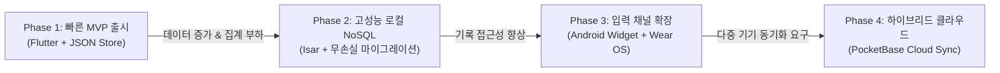

# PROJECT GTG (Grease The Groove)
> **개인 개발 모바일 트래커 | 기획, 개발, Play Store 출시, 아키텍처 개선 전 과정 1인 완주**

[](https://play.google.com/store/apps/details?id=com.forevernewvie.projectgtg&hl=kr)
[](test/)
[](pubspec.yaml)
[](docs/adr/0001-tech-choices.md)

---

## 👨‍💻 엔지니어링 요약 (Key Achievements)

- **제품 1인 릴리스**: 기획부터 UI 디자인, Flutter 앱 개발, Google Play Store 상용 배포 및 유지보수 전 과정을 단독 수행 (`com.forevernewvie.projectgtg`).
- **아키텍처 진화 (ADR 0001)**: 초경량 JSON 저장소(MVP)에서 고성능 Isar NoSQL로의 점진적 스토리지 전환 및 기존 유저 데이터 무손실 마이그레이션 달성.
- **멀티 채널 인터페이스**: 스마트폰 앱 진입 단계를 줄이기 위한 **Android 1-Tap 홈 화면 위젯** 및 **Wear OS 독립 서브앱** 구축.
- **하이브리드 동기화 설계**: 로컬 우선(Offline-First) 보장 + PocketBase 기반 선택적 클라우드 백업/동기화 아키텍처 구축.
- **방어적 품질 보증**: 30개 이상의 단위·위젯·영속성 테스트를 구축하여 엣지 케이스 및 안드로이드 해상도 파편화 사전 차단.

---

## 📱 핵심 기능 및 화면 구성 (App Architecture)

앱은 라우터(`lib/app/router.dart`)를 중심으로 5개의 핵심 도메인 화면과 2개의 외부 입력 채널로 구성되어 있습니다.

| 화면 / 채널 | 라우트 경로 | 주요 기능 및 엔지니어링 포인트 |
| :--- | :--- | :--- |
| **대시보드 (Home)** | `/home` | • 3대 운동(푸쉬업, 풀업, 딥스) 1세트 빠른 기록<br/>• 오늘/주간/월간 종목별 누적 통계 실시간 집계 |
| **캘린더 (Calendar)** | `/calendar` | • 월간 활동 히트맵 잔디 시각화 컴포넌트<br/>• 선택 날짜별 상세 운동 타임라인 조회 |
| **적응형 코치 (Coach)** | `/settings/coach` | • 사용자 누적 기록 기반 권장 횟수/세트수 산출 (`gtg_insight_engine`) |
| **스마트 리마인더** | `/settings/reminders` | • 수면 시간(조용한 시간대), 주말 제외, 하루 최대 알림 상한 계산 (`ReminderOptimizationPolicy`) |
| **전체 기록 (All Logs)** | `/settings/logs` | • 날짜별 그룹화된 전체 히스토리 가상 스크롤 렌더링 |
| **홈 화면 위젯** | `Android Widget` | • `home_widget` 연동을 통해 앱 실행 없이 홈 화면에서 즉시 1-Tap 횟수 누적 |
| **Wear OS 시계 앱** | `wear_app/` | • 스마트폰 없이 손목에서 바로 기록하는 독립형 서브앱 및 양방향 채널 동기화 |

---

## 📈 아키텍처 진화 과정 (How Architecture Evolved)

이 프로젝트는 초기부터 거대한 프레임워크를 도입하지 않고, **요구사항의 변화에 따라 구조를 점진적으로 발전**시켰습니다.



### 1. Phase 1: 빠른 검증을 위한 로컬 MVP ([ADR 0001](docs/adr/0001-tech-choices.md))
- **의사결정**: 1인 개발 환경에서 버그 표면적을 최소화하고 스토어 출시 속도를 높이기 위해 복잡한 DB 대신 `path_provider` 기반 JSON 파일 저장소로 릴리스.
- **효과**: 릴리스 초기 오버엔지니어링 없이 제품 가설을 빠르게 검증.

### 2. Phase 2: 데이터 누적에 따른 Isar NoSQL 도입 및 마이그레이션
- **문제점**: 수개월간 누적된 운동 로그로 인해 월간 히트맵 렌더링 시 전체 JSON 역직렬화 병목 발생.
- **해결책**:
  - 빠른 인덱스 검색과 Dart 객체 직렬화를 지원하는 `Isar Community NoSQL`로 스토리지 전면 교체.
  - **무손실 마이그레이션 설계**: 마이그레이션 마커를 두어 기존 사용자의 JSON 데이터를 Isar로 1회 안전하게 이관하고, 만약 Isar 엔진 초기화 오류 시 자동으로 JSON 모드로 복구되는 Fallback 계층 구축 (`app_startup_failure_fallback_test.dart`).

### 3. Phase 3: 접근성 확장을 위한 위젯 & 스마트워치 서브앱
- **문제점**: 하루 5~10회씩 자주 기록해야 하는 GTG 운동 특성상, 매번 스마트폰을 켜고 앱을 찾는 행위 자체가 기록 누락의 원인이 됨.
- **해결책**:
  - `home_widget`을 도입해 폰 잠금화면/홈 화면에서 한 번의 탭으로 횟수를 누적하는 1-Tap 위젯 개발.
  - 철봉이나 러닝 중 스마트폰 휴대가 불편한 상황을 위해 독립형 Wear OS 앱(`wear_app`) 개발 및 폰-워치 간 실시간 데이터 동기화 채널 구축.

### 4. Phase 4: 선택적 클라우드 동기화 (PocketBase Cloud Sync)
- **설계**: 기기 교체나 분실 시 데이터 백업을 원하는 사용자를 위해, 오프라인 로컬 우선 원칙을 훼손하지 않는 선에서 `PocketBase` 연동 스키마 설계 ([상세 명세서](docs/pocketbase_cloud_sync_schema.md)).

---

## 🛠️ 핵심 트러블슈팅 및 기술적 고민 (Deep Dive)

### 1. DB 손상 및 스키마 변경 시 데이터 유실 방어
- **문제**: 로컬 DB는 디스크 용량 부족이나 스키마 충돌 시 네이티브 바이너리 단에서 크래시가 발생할 수 있음.
- **해결**:
  - `GtgPersistence` 추상 인터페이스를 두고, `Isar` 실행 실패 시 즉시 `JsonFileStore`로 전환하여 앱이 강제 종료되지 않고 실행을 유지하도록 방어 로직 구현.
  - 파일 파싱에 실패할 경우 손상된 파일을 즉시 `.corrupted-[timestamp]`로 격리(Quarantine)하여 무한 부팅 에러를 차단하고 기본 상태로 안전하게 복구.

### 2. 안드로이드 최신 제스처 바(Edge-to-Edge) 및 해상도 파편화 대응
- **문제**: 안드로이드 14+ 기기에서 하단 제스처 바가 앱의 핵심 기록 버튼을 가리거나, 화면비에 따라 레이아웃 오버플로우 발생.
- **해결**:
  - 다양한 가상 화면 크기 및 safe area를 시뮬레이션하는 `android_layout_compat_widget_test.dart`와 `android_edge_to_edge_widget_test.dart` 위젯 테스트 스위트를 작성해 배포 전 렌더링 회귀를 자동 방어.

### 3. 알림 피로도 방지를 위한 도메인 정책 분리
- **문제**: 기계적인 정시 알림은 사용자의 집중을 방해하여 알림 차단을 유발함.
- **해결**:
  - 단순 타이머가 아닌 수면 시간대(Quiet hours), 주말 제외, 하루 최대 알림 상한(`maxPerDay`)을 종합 계산하는 `ReminderOptimizationPolicy` 도메인 엔진을 순수 Dart 클래스로 분리 설계하고 단위 테스트로 완벽 검증.

---

## 🧪 테스트 및 품질 보증

견고한 앱 안정성을 입증하기 위해 총 **30개 이상의 자동화 테스트**를 작성해 운영 중입니다.

```bash
# 전체 테스트 실행
flutter test
```

| 테스트 영역 | 파일 위치 | 핵심 검증 내용 |
| :--- | :--- | :--- |
| **영속성 & 데이터 복구** | `test/isar_migration_persistence_test.dart`<br/>`test/app_startup_failure_fallback_test.dart` | • JSON ➡️ Isar 1회 무손실 데이터 이관<br/>• DB 크래시 시 JSON Fallback 자동 전환 |
| **코칭 & 알림 도메인** | `test/adaptive_gtg_coach_test.dart`<br/>`test/reminder_optimization_policy_test.dart` | • 유저 운동 빈도 기반 적응형 코칭 산출<br/>• 수면 시간대 배제 및 알림 상한 간격 계산 |
| **위젯 및 인터랙션** | `test/dashboard_quick_log_widget_test.dart`<br/>`test/calendar_heatmap_widget_test.dart` | • 1탭 기록 시 상태 반응성 및 오늘 합계 갱신<br/>• 월간 히트맵 날짜별 렌더링 검증 |
| **기기 호환성** | `test/android_layout_compat_widget_test.dart`<br/>`test/android_edge_to_edge_widget_test.dart` | • 기기별 DPI/화면비 레이아웃 오버플로우 방지<br/>• 시스템 제스처 네비게이션 겹침 방지 |

---

## 📂 프로젝트 구조

```text
lib/
├── app/               # 앱 진입점, 라우팅(GoRouter), 전역 설정
├── core/              # 공통 모델, 환경 변수, 유틸리티
├── data/
│   ├── isar/          # Isar 컬렉션 스키마 및 마이그레이션 로직
│   └── persistence/   # 이중 영속성 계층 (Isar + JSON Fallback)
├── features/
│   ├── workout/       # 메인 운동 기록 및 집계 (Dashboard)
│   ├── coaching/      # 적응형 코칭 인사이트 엔진 (GtgCoach)
│   ├── calendar/      # 월간 히트맵 및 일자별 상세 내역 (Calendar)
│   ├── reminders/     # 알림 정책 및 스케줄러 (Reminders)
│   ├── widget_sync/   # Android 홈 화면 위젯 연동
│   ├── watch_sync/    # Wear OS 시계 동기화 채널
│   └── settings/      # 테마 및 환경 설정
└── l10n/              # ARB 기반 공식 다국어 지원 (ko/en)

wear_app/              # 독립형 Wear OS Flutter 서브 프로젝트
docs/                  # ADR 의사결정서, PocketBase 스키마, 기획 문서
test/                  # 30여 개 테스트 스위트
```

---

## 🚀 빠른 시작 (Local Setup)

```bash
# 의존성 설치
flutter pub get

# Isar DB 및 다국어 코드 생성
dart run build_runner build --delete-conflicting-outputs

# 정적 분석 및 테스트 실행
flutter analyze
flutter test

# 앱 실행
flutter run
```
