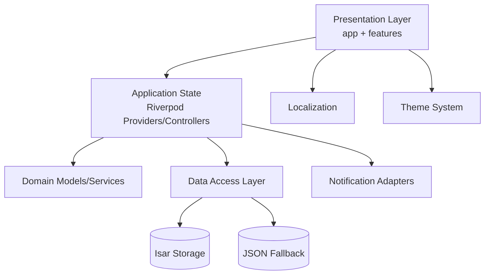

# GTG ISO-Oriented Technical File

- Project: `project-gtg-flutter`
- Baseline Branch: `main`
- Working Branch: `codex/feature/iso-techfile`
- Document Purpose: ISO audit-ready technical specification and implementation guidance

---

## 1. 요구사항 정의서 (Requirements Definition)

### 1.1 문서 통제 정보

| 항목 | 내용 |
|---|---|
| 품질 표준 적용 | ISO 9001, ISO/IEC 25010, ISO/IEC 12207 |
| 대상 시스템 | GTG Flutter Mobile App (iOS/Android) |
| 품질 우선순위 | 확장성, 유지보수성, 신뢰성, 사용성 |
| 변경 관리 원칙 | PR 기반 변경, 형상관리, 테스트 증적 필수 |

### 1.2 비즈니스/운영 요구사항

| ID | 요구사항 | 수용 기준 |
|---|---|---|
| BR-001 | 사용자는 3종 운동(Push-up/Pull-up/Dip)을 3탭 이내로 기록할 수 있어야 함 | 홈 화면에서 +/- 및 Log 버튼으로 즉시 저장 |
| BR-002 | 월간 습관 지속성을 시각적으로 확인할 수 있어야 함 | 캘린더 히트맵 + 일자 상세 표시 |
| BR-003 | 알림은 사용자 제어(간격/조용한 시간/주말 제외)가 가능해야 함 | Reminder Settings에서 모두 설정/저장 가능 |
| BR-004 | 라이트/다크 모드 전환이 즉시 반영되고 앱 재시작 후 유지되어야 함 | Settings 테마 선택 + 영속화 검증 |

### 1.3 기능 요구사항

| ID | 기능 요구사항 |
|---|---|
| FR-001 | 온보딩: 기본 운동 선택 및 스킵 지원 |
| FR-002 | 홈: 빠른 기록, 오늘 합계, 최근 기록 표시 |
| FR-003 | 캘린더: 월 이동, 히트맵, 선택 일자 타임라인 표시 |
| FR-004 | 리마인더: 활성화, 스케줄 파라미터 편집, 권한 연동 |
| FR-005 | 설정: Theme(System/Light/Dark), 리마인더/로그 진입 |
| FR-006 | 전체 기록: 날짜별 그룹핑 조회 |

### 1.4 비기능 요구사항 (ISO/IEC 25010 매핑)

| 품질 특성 | 요구사항 | 현재 구현 근거 |
|---|---|---|
| Functional suitability | 핵심 사용자 시나리오 완결성 | 홈/캘린더/설정/리마인더/온보딩 구현 |
| Performance efficiency | 초기 로드 및 UI 반응성 확보 | 경량 로컬 저장, Riverpod 상태 분리 |
| Compatibility | Android/iOS 지원 | Flutter 멀티플랫폼 |
| Usability | 한손 조작, 직관적 정보 구조 | 하단 탭 + 카드 기반 UI |
| Reliability | 장애 시 서비스 연속성 | Isar 실패 시 JSON fallback |
| Security | 민감정보/권한 최소화 | 로컬 저장, 권한 거부 처리, 외부 URL 예외 처리 |
| Maintainability | 모듈 분리, 테스트 가능 구조 | `app/core/data/features` 분리, 테스트 다수 |
| Portability | 재배포/이식성 | Flutter 빌드 체계, 표준 CI 명령 |

### 1.5 수명주기 요구사항 (ISO/IEC 12207)

| 단계 | 적용 방식 |
|---|---|
| 요구 분석 | 기능/품질 요구사항 ID 기반 정의 |
| 설계 | 레이어드 아키텍처 + SOLID 원칙 |
| 구현 | Riverpod AsyncNotifier, Repository 분리 |
| 검증 | format/analyze/test + smoke scripts |
| 배포 | debug/release 빌드 스크립트 제공 |
| 유지보수 | 브랜치 규칙(`codex/...`), PR 기반 변경 |

### 1.6 품질경영 구조 (ISO 9001)

| PDCA | 프로젝트 적용 |
|---|---|
| Plan | 요구사항/품질 기준 정의, 테스트 전략 수립 |
| Do | 기능 구현 및 코드 리뷰 |
| Check | 정적분석/테스트/스모크/Gate 점검 |
| Act | 결함 수정, 문서/프로세스 개선 반영 |

---

## 2. 기능 명세서 (Functional Specification)

### 2.1 화면/기능 명세

| 화면 | 기능 | 입력 | 출력 | 상태 변화 |
|---|---|---|---|---|
| Onboarding | 기본 운동 선택/완료/스킵 | 운동 타입 선택 | 홈 진입 준비 | `hasCompletedOnboarding` 갱신 |
| Home | 빠른 기록 | 운동 종류, reps | 오늘 누적/최근 기록 갱신 | 로그 추가 저장 |
| Calendar | 월간 히트맵, 일자 상세 | 월 이동/일자 탭 | 월 누적, 일자 타임라인 | 선택 일자 변경 |
| Reminder Settings | 알림 스위치/간격/시간대 | 스위치, 드롭다운, 시간 선택 | 다음 예약 요약 | reminder 설정 저장/재스케줄 |
| All Logs | 전체 기록 조회 | 스크롤 | 날짜별 그룹 로그 | 읽기 전용 |
| Settings | 테마 선택, 화면 이동 | 세그먼트 선택/탭 | 즉시 테마 반영 | theme preference 저장 |

### 2.2 기능 경계 명시

- 현재 릴리스에서 **명시적 편집/Undo UI는 제공되지 않음** (히스토리는 조회 중심).
- 외부 백엔드 동기화 API 없음 (로컬 퍼시스턴스 중심).

---

## 3. 시스템 아키텍처 설계 (System Architecture Design)

### 3.1 아키텍처 개요



### 3.2 SOLID 적용 설계

| 원칙 | 적용 |
|---|---|
| SRP | 화면, 상태컨트롤러, 저장소, 알림클라이언트 분리 |
| OCP | 저장소 모드(Isar/JSON) 전환이 클라이언트 코드 변경 최소화 |
| LSP | 클라이언트 인터페이스 대체 가능 구조(알림/권한 어댑터) |
| ISP | 기능별 좁은 인터페이스(권한/스케줄/메시지 분리) |
| DIP | 상위 모듈이 구체 구현 대신 Provider/인터페이스에 의존 |

### 3.3 확장성/유지보수 전략

- `features/*` 단위 수평 확장(새 도메인 기능 추가 가능)
- 상태 로직을 AsyncNotifier로 캡슐화하여 테스트 용이성 확보
- 저장소 마이그레이션 전략 내장(Isar 우선 + JSON fallback)

### 3.4 보안/성능 설계 고려

| 관점 | 위험 | 설계 대응 |
|---|---|---|
| 보안 | 외부 URL 열기 실패/악성 링크 | URI 검증 + 실패 snackbar 처리 |
| 보안 | 알림 권한 미허용 상태 | 권한 체크 후 비활성화/재스케줄 중단 |
| 성능 | 월간 히트맵 렌더링 부하 | 월 단위 집계, 필요한 범위만 계산 |
| 성능 | 과도한 상태 재계산 | Provider 분리(today totals, logs 등) |

---

## 4. 데이터 구조 설계 (Data Structure Design)

### 4.1 핵심 도메인 모델

| 모델 | 주요 필드 | 제약 |
|---|---|---|
| ExerciseLog | `id`, `type`, `reps`, `timestamp` | `reps >= 1` |
| ReminderSettings | `enabled`, `intervalMinutes`, `quietStartMinutes`, `quietEndMinutes`, `skipWeekends`, `maxPerDay` | 범위/유효시간 보장 |
| UserPreferences | `hasCompletedOnboarding`, `primaryExercise` | 기본값 존재 |
| AppThemePreference | `system/light/dark` | enum 기반 제한 |

### 4.2 저장 전략

| 계층 | 용도 |
|---|---|
| Isar | 기본 저장소(정상 운영 경로) |
| JSON | 레거시 데이터 마이그레이션 소스 + fallback |
| JSON atomic write | tmp 파일 작성 후 rename으로 무결성 강화 |
| Corruption quarantine | 손상 파일을 `.corrupted-*`로 격리 |

### 4.3 마이그레이션 설계

1. Isar open 시도
2. migration marker 확인
3. marker 없으면 JSON 데이터 1회 이관
4. 실패 시 JSON 모드 fallback

---

## 5. API 명세 (API Specification)

> 현재 릴리스는 외부 REST API가 없으며, 아래는 내부 애플리케이션 API(서비스/컨트롤러 계약) 명세다.

### 5.1 내부 API 계약

| 모듈 | 시그니처 | 목적 | 예외 가능성 |
|---|---|---|---|
| WorkoutController | `addLog(type, reps, {timestamp})` | 운동 로그 추가 및 저장 | 저장 실패 I/O |
| WorkoutController | `clearAll()` | 로그 초기화 | 저장 실패 I/O |
| ReminderController | `setEnabled(bool)` | 알림 on/off + 권한 흐름 | 권한 거부 |
| ReminderController | `updateSettings(settings)` | 리마인더 설정 저장/재스케줄 | 스케줄링 실패 |
| GtgPersistence | `load*/save*` | 엔티티 영속화 | DB/파일 접근 실패 |
| ThemePreferenceController | `setPreference(pref)` | 테마 선호 저장 | 파일 저장 실패 |

### 5.2 라우팅 API (내부 경로)

| Route | 설명 |
|---|---|
| `/home` | Dashboard |
| `/calendar` | Calendar |
| `/settings` | Settings |
| `/settings/reminders` | Reminder Settings |
| `/settings/logs` | All Logs |

---

## 6. 예외 처리 정책 (Exception Handling Policy)

### 6.1 예외 분류

| 유형 | 예시 | 정책 |
|---|---|---|
| 권한 예외 | 알림 권한 거부 | 기능 비활성화 + 사용자 안내 |
| 저장소 예외 | Isar init 실패 | JSON fallback + 로그 기록 |
| 데이터 예외 | JSON 파싱 실패 | 손상 파일 격리 + 기본값 복구 |
| 외부 호출 예외 | 브라우저 링크 오픈 실패 | Snackbar 안내 + 앱 지속 |

### 6.2 로깅 정책

- 레벨: `info`, `warning`, `error`
- 원칙:
  - 사용자 식별 정보 로그 금지
  - 예외 발생 시 stackTrace 포함
  - 운영 판단 가능 메시지 유지

### 6.3 사전 위험 분석 (Failure Point Analysis)

| 위험 지점 | 발생 조건 | 예방/완화 |
|---|---|---|
| Isar open 실패 | 디스크/권한/스키마 문제 | JSON fallback |
| 스케줄 재생성 실패 | 권한/시간 계산 오류 | try-catch + cancelAll/재계산 |
| Calendar 집계 병목 | 로그 대량화 | 범위 집계/Provider 분리 |
| Theme 저장 실패 | 파일 접근 실패 | 기본 `system` fallback |

---

## 7. 테스트 케이스 (Test Cases)

### 7.1 테스트 전략

| 레벨 | 목적 | 대표 파일 |
|---|---|---|
| Unit | 모델/서비스 로직 검증 | `workout_analytics_service_test.dart` |
| Persistence | 마이그레이션/저장소 안정성 | `isar_migration_persistence_test.dart`, `gtg_persistence_test.dart` |
| Widget | 화면 인터랙션/상태 검증 | `dashboard_quick_log_widget_test.dart`, `settings_screen_widget_test.dart` |
| Layout compatibility | 오버플로우/레이아웃 안정성 | `android_layout_compat_widget_test.dart` |

### 7.2 핵심 테스트 케이스 표

| ID | 시나리오 | 입력 | 기대 결과 |
|---|---|---|---|
| TC-001 | 빠른 로그 기록 | Push-up 10 + Log | 로그 1건 추가, 오늘 합계 증가 |
| TC-002 | 캘린더 일자 탭 | 특정 날짜 선택 | 선택 일자 상세/합계 반영 |
| TC-003 | 리마인더 권한 거부 | enable true | 설정 false 유지 + 안내 메시지 |
| TC-004 | 테마 변경 | Dark 선택 | 즉시 다크 반영 + 재실행 후 유지 |
| TC-005 | 손상 JSON 복구 | malformed JSON | 파일 격리 + 기본값 로드 |

---

## 8. 코드 구현 (Code Implementation)

> 아래 코드는 테스트 가능한 구조, 의존성 분리, 로깅, 예외 대응을 보여주는 참조 구현 예시다.

```dart
/// Application-level configuration contract.
/// Purpose: Centralize runtime-config values and avoid hardcoded literals.
abstract interface class AppConfig {
  /// Returns the supported repetition range.
  /// Purpose: Prevent magic numbers in UI/domain logic.
  ({int minReps, int maxReps}) repsRange();

  /// Returns reminder scheduling constraints.
  /// Purpose: Keep scheduling limits configurable by environment.
  ({int minIntervalMinutes, int maxPerDay}) reminderConstraints();
}

/// Structured logger interface.
/// Purpose: Decouple business logic from concrete logging implementation.
abstract interface class AppLogger {
  /// Writes informational events.
  /// Purpose: Track normal workflow transitions.
  void info(String message);

  /// Writes warning events.
  /// Purpose: Record recoverable anomalies.
  void warning(String message, {Object? error, StackTrace? stackTrace});

  /// Writes error events.
  /// Purpose: Record non-recoverable or critical failures.
  void error(String message, {Object? error, StackTrace? stackTrace});
}

/// Repository contract for workout logs.
/// Purpose: Enable test doubles and storage backend substitution.
abstract interface class WorkoutRepository {
  /// Loads all logs.
  /// Purpose: Provide current persisted state.
  Future<List<ExerciseLog>> loadLogs();

  /// Saves all logs atomically.
  /// Purpose: Persist full snapshot safely.
  Future<void> saveLogs(List<ExerciseLog> logs);
}

/// Service implementing domain-safe write operations.
/// Purpose: Keep controller/UI thin and business rules centralized.
final class WorkoutCommandService {
  WorkoutCommandService({
    required WorkoutRepository repository,
    required AppConfig config,
    required AppLogger logger,
  }) : _repository = repository,
       _config = config,
       _logger = logger;

  final WorkoutRepository _repository;
  final AppConfig _config;
  final AppLogger _logger;

  /// Appends a validated log and persists it.
  /// Purpose: Apply business constraints before storage.
  Future<List<ExerciseLog>> appendLog({
    required List<ExerciseLog> current,
    required ExerciseType type,
    required int reps,
    required DateTime timestamp,
  }) async {
    final range = _config.repsRange();
    final normalized = reps.clamp(range.minReps, range.maxReps);

    final next = List<ExerciseLog>.unmodifiable(<ExerciseLog>[
      ...current,
      ExerciseLog(
        id: timestamp.microsecondsSinceEpoch.toString(),
        type: type,
        reps: normalized,
        timestamp: timestamp,
      ),
    ]);

    try {
      await _repository.saveLogs(next);
      _logger.info('Workout log appended: type=$type reps=$normalized');
      return next;
    } catch (error, stackTrace) {
      _logger.error(
        'Failed to persist workout logs.',
        error: error,
        stackTrace: stackTrace,
      );
      rethrow;
    }
  }
}
```

---

## 9. 코드 검증 리포트 (Code Verification Report)

### 9.1 검증 기준

| 항목 | 명령 |
|---|---|
| 포맷 검증 | `dart format --set-exit-if-changed .` |
| 정적분석 | `flutter analyze` |
| 테스트 | `flutter test` |

### 9.2 현재 검증 상태 (최근 실행 기준)

| 항목 | 결과 |
|---|---|
| Format | PASS |
| Analyze | PASS (`No issues found`) |
| Test | PASS (`All tests passed`) |

### 9.3 성능 병목 가능성 분석

| 후보 | 영향 | 대응 |
|---|---|---|
| 로그량 증가 시 월 집계 비용 | Calendar 렌더 지연 가능 | 월 단위 캐시/증분 집계 도입 고려 |
| 대량 로그 전체 정렬 | Home/All Logs 렌더 지연 | 페이지네이션/가상 스크롤 고려 |
| 리마인더 재스케줄 빈도 | 배터리/CPU 영향 | 설정 변경 시점 중심 재스케줄 유지 |

### 9.4 보안 취약점 분석

| 취약점 유형 | 리스크 | 완화 전략 |
|---|---|---|
| 토큰/시크릿 하드코딩 | 유출 사고 | `.env.local`/CI secret 사용, Git 추적 금지 |
| 외부 링크 처리 | 악성 URI 유입 | URI 파싱 검증 + 실패 차단 |
| 과도한 로그 노출 | 개인정보/운영 정보 유출 | PII 비수집, 로그 레벨 정책 준수 |

---

## 10. 유지보수 가이드 (Maintenance Guide)

### 10.1 변경 관리 절차

1. `main` 최신화 후 `codex/feature/*` 브랜치 생성
2. 구현 + 테스트
3. `format/analyze/test` 통과
4. PR 생성 및 리뷰
5. `main` 병합 후 브랜치 정리

### 10.2 운영 체크리스트

| 항목 | 주기 |
|---|---|
| 의존성 업데이트 검토(`flutter pub outdated`) | 월 1회 |
| 알림 권한 동작 회귀 테스트 | 릴리즈마다 |
| 라이트/다크 모드 UI 회귀 점검 | 릴리즈마다 |
| 로컬 저장소 마이그레이션 테스트 | 저장소 구조 변경 시 |

### 10.3 기술 부채 관리

- 명시적 히스토리 편집/undo UX 도입 여부를 기능 요구사항으로 분리 관리
- 캘린더 집계 최적화(캐싱) RFC 작성
- integration_test 도입(현재는 widget/unit 중심)

### 10.4 장애 대응 가이드

- Step 1: 로그 레벨 `error/warning` 우선 확인
- Step 2: `flutter clean && flutter pub get`
- Step 3: `flutter analyze && flutter test`
- Step 4: 플랫폼별 smoke script 실행

---

## 부록 A. 품질 규칙 준수 체크

| 규칙 | 적용 상태 | 비고 |
|---|---|---|
| 하드코딩 금지 | 부분 준수 | 설정/상수 분리 지속 필요 |
| 매직넘버 금지 | 부분 준수 | 도메인 경계값 상수화 진행 권장 |
| 중복 로직 금지 | 부분 준수 | Analytics/Formatting 공통화 유지 |
| 환경변수 분리 | 준수 | `Env` 기반 테스트 플래그 사용 |
| 의존성 분리 | 준수 | Provider/Repository/Adapter 구조 |
| 로깅 구조 포함 | 준수 | AppLogger 인터페이스/구현 사용 |

